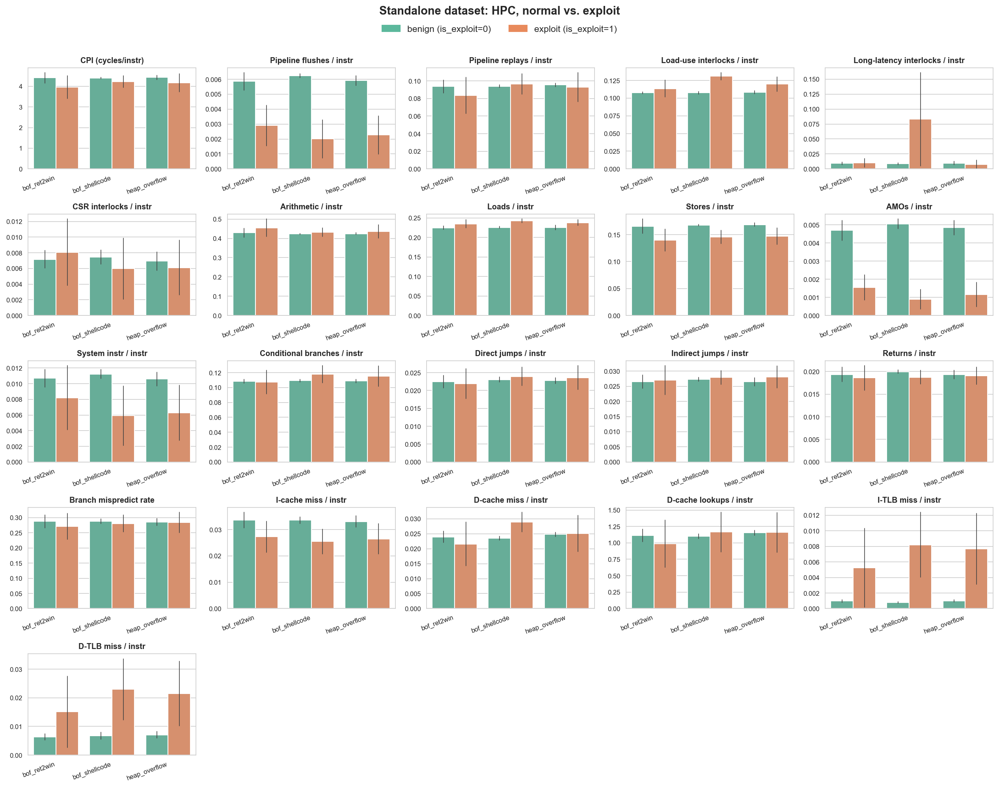
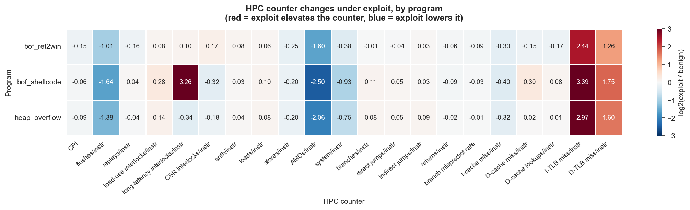
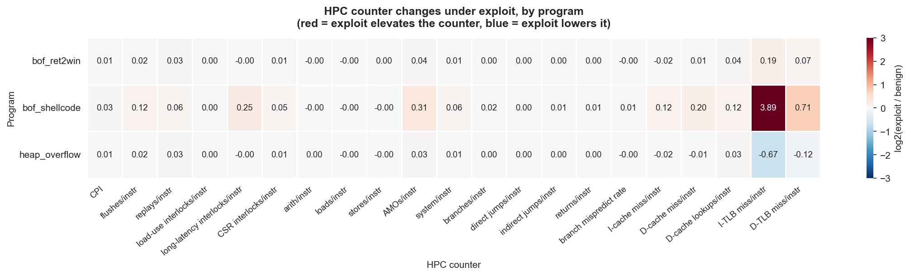
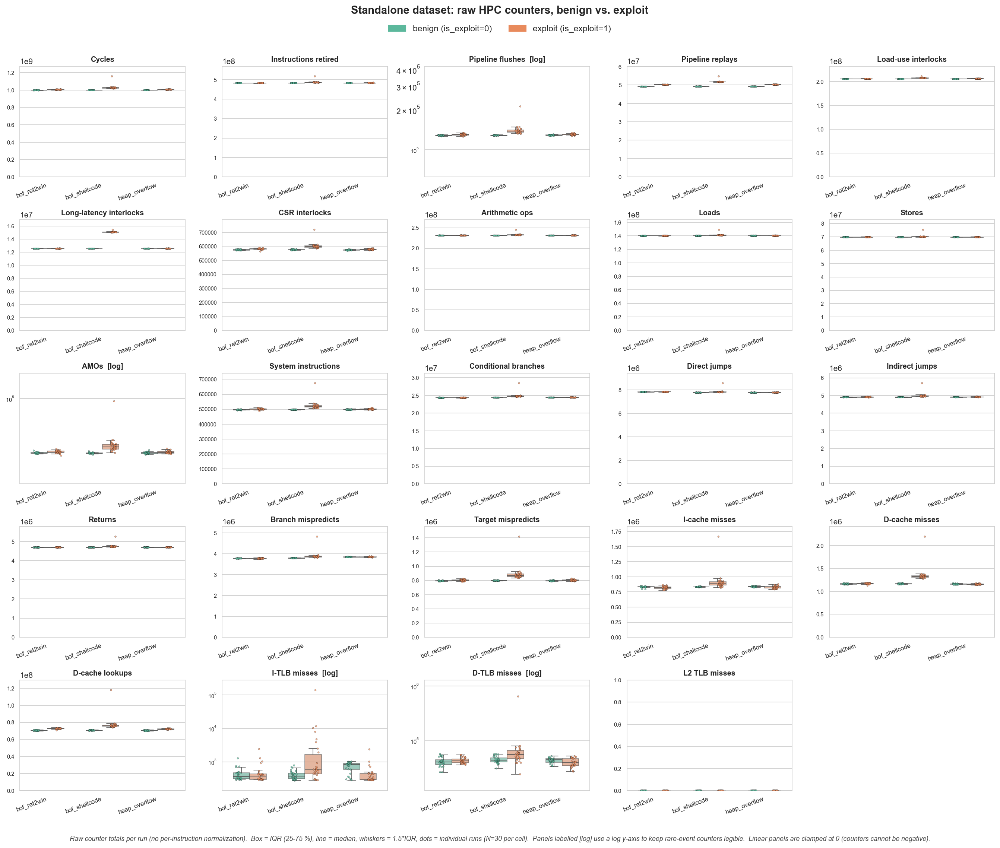
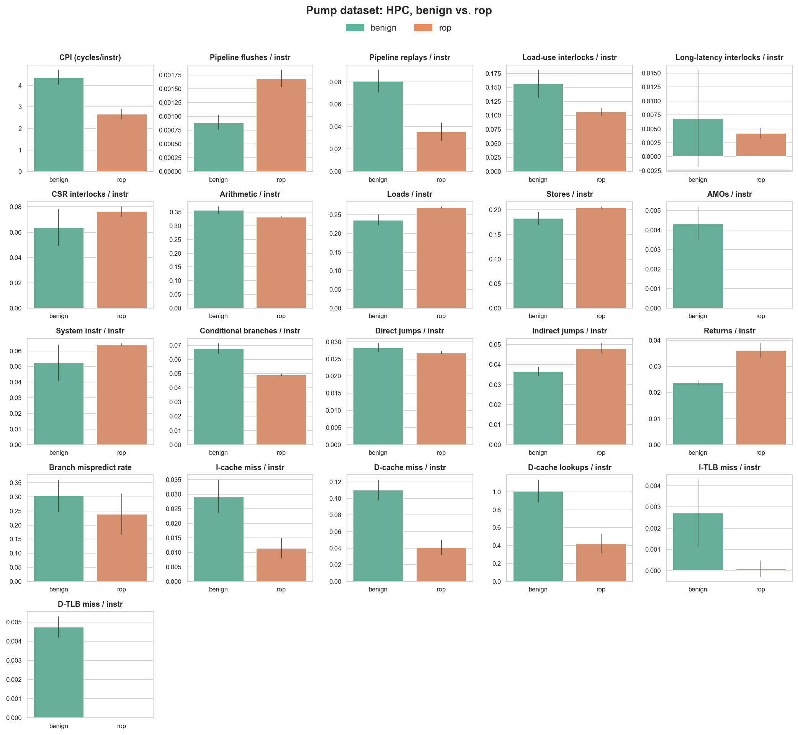
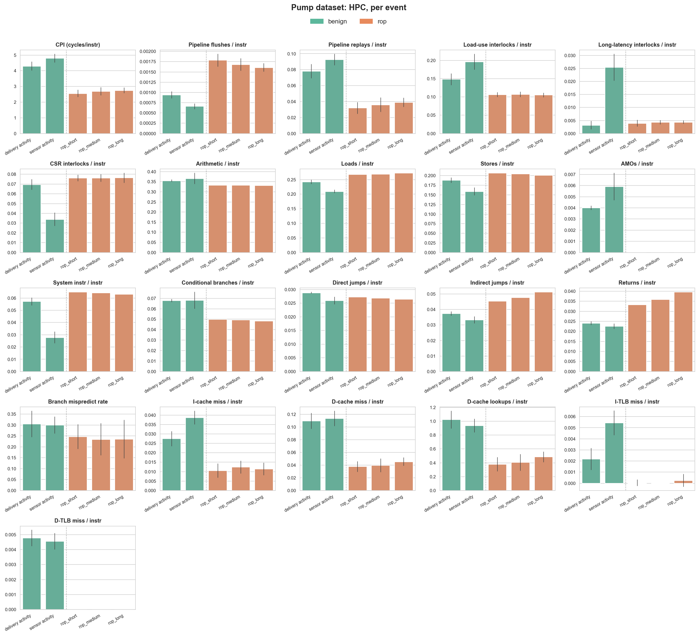
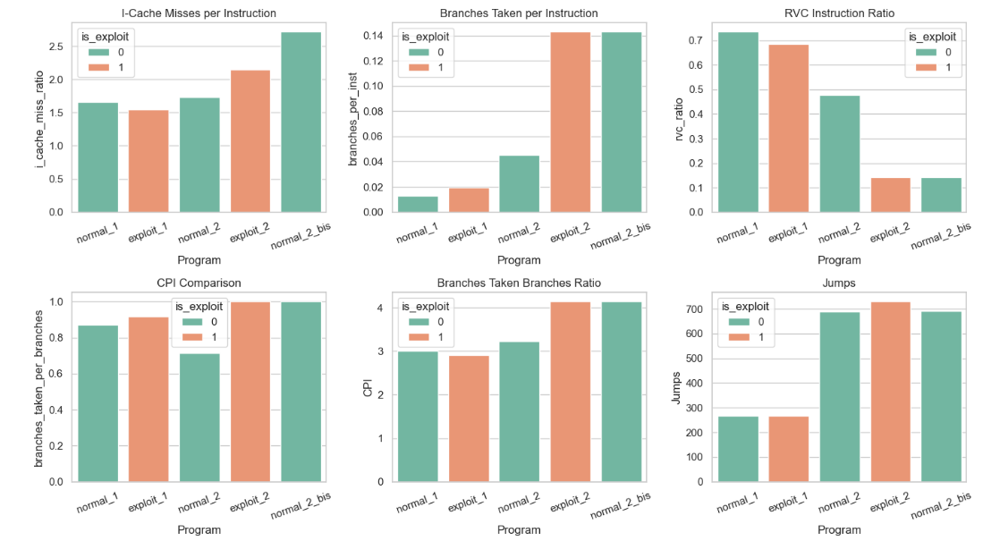

# HPC-based Exploit Detection — Results

FPGA: Nexys-video
OS: Linux
Core: Rocket (with a new ret counter)

## Datasets

### Standalone programs (`dataset_standalone.csv`)

7 binaries:
- 4 non vulnerable programs 
- 3 vulnerable programs

300 runs, each program ran 30 times. Vulnerable programs were ran 30x times with a benign input and 30 times with an exploit. 

300 runs across 7 binaries, with 30 runs per condition. The three exploit
binaries each ran twice — once on benign input (control flow stays normal,
program exits 0) and once on malicious input (exploit fires) — giving three
clean paired comparisons:

### Insulin pump trace (`dataset.csv`)

Insulin Pump emulator with embedded gadgets to simulate a ROP chain attack.
The program simulate the execution of an insulin pump, every 30 seconds a ROP chain is triggered. The program was ran for 1h.

## Counters used

Normalised on the instructions count. All base Rocket counters + custom ret counter.

- `cycle`
- `instret`
- `load`
- `store`
- `amo`
- `system`
- `arith`
- `branch`
- `jal`
- `jalr`
- `ret`
- `load_intl`
- `ll_intl`
- `csr_intl`
- `dcache_blk`
- `br_misp`
- `tgt_misp`
- `flush`
- `replay`
- `icache_miss`
- `dcache_miss`
- `itlb_miss`
- `dtlb_miss`
- `l2_tlb_miss`                        

## Results — standalone programs

Green = normal run, orange = exploit run.

### HPC counters by program (benign vs. exploit)

### Per-program heatmap

### Higher Workload standalone results

## Results — insulin pump

### Benign vs.  ROP attacks

### Event breakdown

## Results - Gvsoc Baremetal

## Updated Thesis Plan

1. Introduction
   - Embedded systems as exploitation targets
   - Problem statement
   - Research questions and objectives
   - Thesis structure

2. Background and Related Work
    - Embedded and IoT security landscape
        - Architectural diversity (RISC-V, ARM, etc.)
        - Threat surface unique to embedded targets
    - Code-reuse attacks
        - ROP, JOP, COP
        - RISC-V-specific considerations
    - Hardware Performance Counters as a exploitation detection mechanism
        - kBouncer, SIGDROP, ROPSentry
    - Limitations and open challenges

3. Threat Model and Attack Design
    - Target system: medical embedded device
    - Attacker capabilities and assumptions
    - Attack families implemented
        - Stack-smash exploits (ret2win, shellcode injection, heap overflow)
        - ROP chains
        - JOP chains
    - Insulin pump emulator
        - Emulator Summary
        - Embedded ROP payloads

4. Detection Architecture
   - Design
   - HPC selection
   - Detection-pipeline overview

5. FPGA Implementation
   - PULP baseline
   - Custom HPC unit in Rocket
   - HPC retrieval from linux userspace
   - FPGA implementation
   - Tooling
   - Validation

6. Dataset Generation
    - Standalone vulnerability dataset
    - Programs and pairing
        - Run protocol
    - Pump emulator dataset
        - Workload phases
        - Inline Attack-trigger
   - Counter inventory and normalization

7. Experimental Evaluation
   - Per-counter analysis
       - Standalone: paired benign-vs-exploit
       - Pump: workload vs ROP
   - Multi Counter signature
   - Classification and detection
        - Attack classification
        - Exploit Detection using Counter classifier
   - Cross-dataset comparison

8. Limitations
    - Sample-size and class-imbalance constraints
    - Detector evaluation (classifiers, Z-scores, ...) 
9. Conclusion
